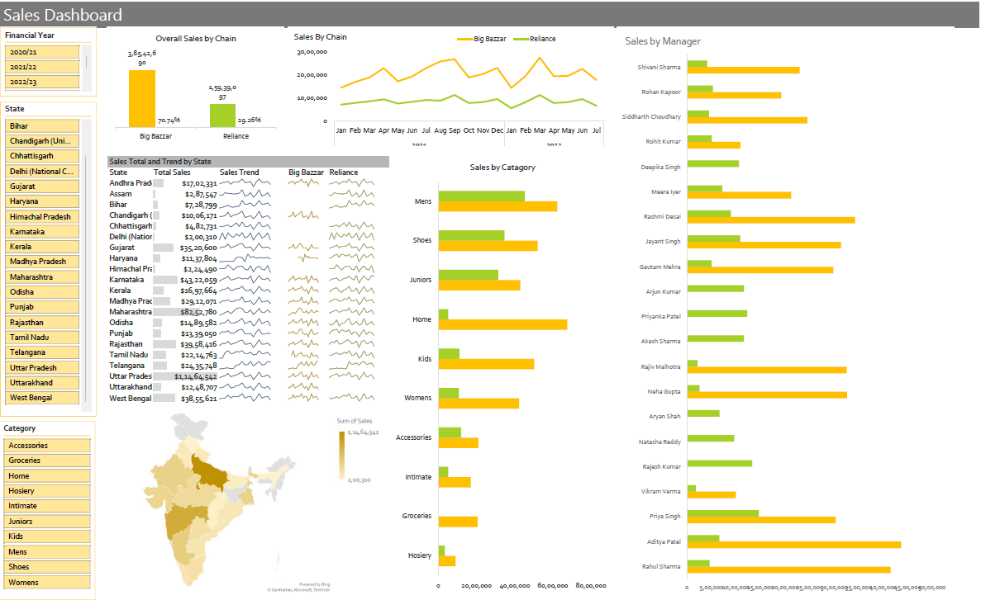

# Interactive Excel Sales Dashboard
## Overview
This repository showcases an Interactive Excel Sales Dashboard designed to visualize and analyze sales performance efficiently. The dashboard incorporates dynamic features such as slicers, charts, and KPIs to provide an insightful overview of sales metrics.

## Features

**Dynamic Visualization:** Interactive charts and graphs that update with slicers.
**Key Performance Indicators (KPIs):** Instant tracking of metrics like Total Revenue, Profit, and Sales Growth.
**Data Filtering:** Easy-to-use slicers for filtering data by product, region, time period, and more.
**Trend Analysis:** Visual representation of sales trends over time.
**User-Friendly Interface:** Intuitive layout designed for simplicity and clarity.

**Dashboard Highlights**

Sales trends by State, Store, Category.
A clean and polished design, ensuring easy navigation.

**How to Use**
`Download the File:
    Clone the repository or download the .xlsx file directly.
Open in Excel:
    Open the file in Microsoft Excel (2016 or later recommended for full compatibility).
Interact with Slicers:
    Use slicers to filter and view data across various dimensions like region, product, or time.`

**Prerequisites**
Microsoft Excel (2016 or later recommended for best compatibility).
Basic familiarity with Excel features like slicers and charts.

**Preview**

Repository Structure
Sales-Dashboard.xlsx: The main Excel file containing the interactive dashboard.
Sample-Data.csv: Sample dataset used to create the dashboard.
README.md: This documentation file.
Contribution
Contributions, issues, and feature requests are welcome! Feel free to submit a pull request or open an issue in the repository.

**License**
Free to use 😊

**Contact**
If you have any questions or feedback, feel free to reach out:

Name: Chandra Prakash Singh Bhati
Email: email.cpsbhati@gmail.com
LinkedIn: linkedin.com/in/cpsbhati
